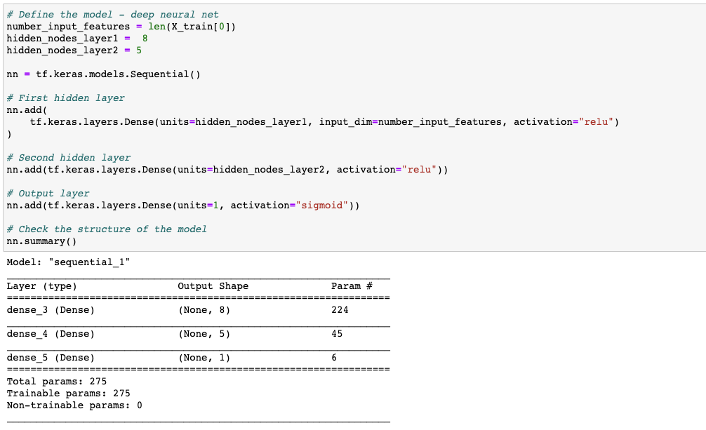

## Charity Grant Analysis
This project used a mock list of 34,000 grants given from a foundation. The goal was to evaluate the grants given to predict the success of future ventures to guide funding decisions. Deep neural networks, TensorFlow and Scikit-Learn, were used for the machine learning model. Project for UC Berkeley Data Analytics Boot Camp.

### Data Analysis
Initially I preprocessed the data by dropping some columns and used One Hot Encoder to fit the categories. For the initial neural network model, I used two hidden layers, the first had 8 nodes and the second had 5 nodes. I used relu activation on the hidden layers and sigmoid activation for the output layer since it is best in binary classification. With my initial model, I achieved an accuracy of .53, which is not an effective model. 

I was not able to achieve target peformance with the model and tested different models to improve performance. I tried models with one hidden layer and with three hidden layers and I increased the nodes to 12 on the first layer. I also changed the activation in the hidden layer to tanh and decreased the epochs to 50 from 100. I was not able to improve the performance with the changes to the modeling. With my experience in grant funding and nonprofits, I believe the features I chose to keep are important to the analysis, but the next step would be to remove features that may be confusing the model.

For further analysis and modeling, I would implement a SVM machine learning model and compare the results with the neural network model. I believe that the SVM model has the ability to classify the successful grants and deal with binary output, taking all of the features into consideration, could make it a better fit without overfitting. 

### Tech Used
- Jupyter Notebook
- Python 3
- Pandas
- TensorFlow
- scikit-learn

#### Code Sample
